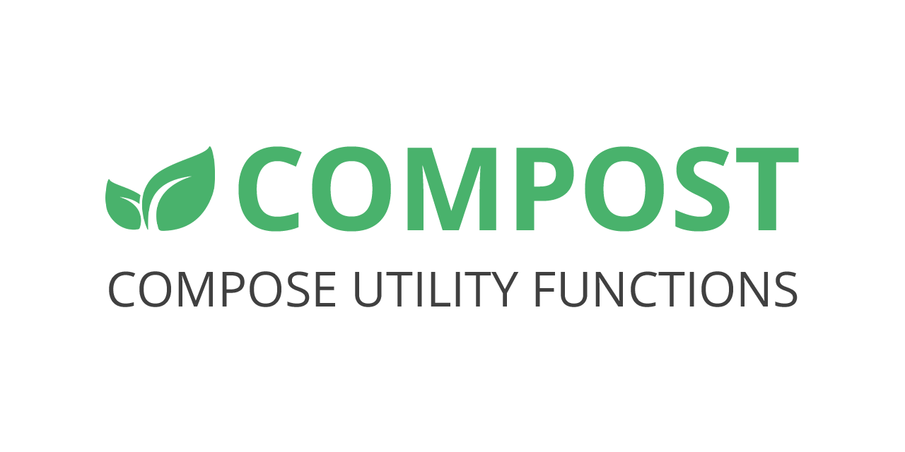

<div align="center">



[](https://jitpack.io/#mephistolie/compost)

</div>

Compost is a kit of utility functions for Jetpack Compose that aim to speed up writing of common or simple things.

## Modules

### 🔧 [Core](./core/)
A library that provides useful modifiers, shapes, scope extensions, etc.
### ✨ [UI](./ui/)
A library that provide reusable animated UI-components.
### 📱 [Demo](./demo/)
Android Demo App with library features.

## Implementation

To start you must add [JitPack Repository](https://www.jitpack.io/) to your project.

Then add the following line in your app module:

##### Groovy
```
dependencies {
    ...
    implementation 'com.github.mephistolie:compost:<version>'
    ...
}
```

##### Kotlin
```
dependencies {
    ...
    implementation("com.github.mephistolie:compost:<version>")
    ...
}
```

Compost is a multimodule library, so you can implement just modules you need:

<table>
 <tr>
  <td><b>Name</b></td><td align="center"><b>Implementation</b></td>
 </tr>
 <tr>
  <td>Core</td><td>com.github.mephistolie.compost:compost-core</td>
 </tr>
 <tr>
  <td>UI</td><td>com.github.mephistolie.compost:compost-ui</td>
 </tr>
</table>

## Contributions

Compost is a collection of independent useful things, so community defines it. Please contribute - we are happy to merge it!

Please use [GitFlow](https://www.atlassian.com/git/tutorials/comparing-workflows/gitflow-workflow) and
[Conventional Commits](https://www.conventionalcommits.org/en/v1.0.0/) to keep Git history clean:
* `feature/XXX` for new stuff
* `refactor/XXX` for improving existing stuff
* `fix/XXX` for bug fixes

If you add new features, describe it in suitable README. Every feature should have documentation in code, description in
README.md and demonstration at demo app.

If you add someone else's code to collection, make sure that you do not violate the rights and added link to source.
